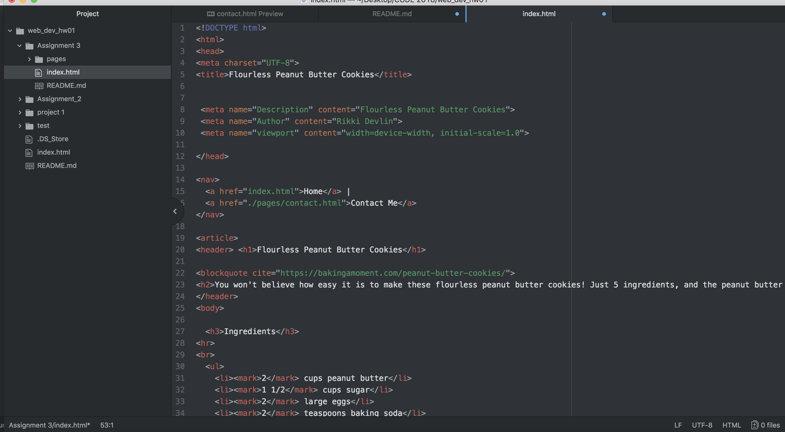

<h2> README.md </h2>

A page can only have ONE "head" and ONE "body" elements.
The head element is information for the browser and search engines. It is not see by viewers.
The body element is the content of the webpage visible by viewers.

Structural markup is the markup that structures the page layout, where as semantic markup is the markup that changes how the content is viewed and read.

It took me awhile to get this is done, but it is very straight forward. As soon as I can get my computer to push and publish I will be on track with the rest of the class.

