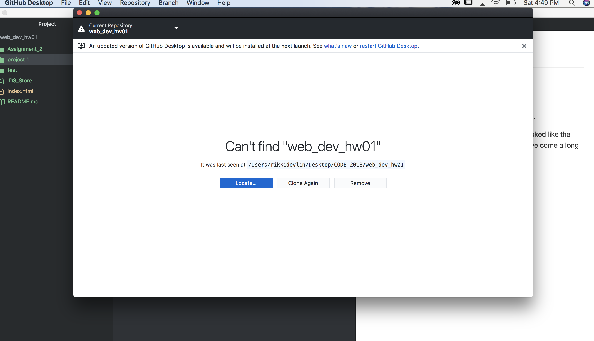

# Technical Report
1.Safari

2.Chrome

A browser essentially translates HTML or Java script.

I visited The New York Times webpage in 1996. It looked like the front page of a paper and was hard to navigate, we've come a long way.

  
